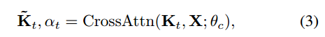

# ADAPT:Vision-Language Navigation with Modality-Aligned Action Prompts

模态对齐的动作提示

## 摘要

**Vision-Language Navigation (VLN)** is a challenging task that requires an embodied agent to perform action-level modality alignment, i.e., make instruction-asked actions sequentially in complex visual environments. Most existing VLN agents learn the instruction-path data directly and cannot sufficiently explore action-level alignment knowledge inside the multi-modal inputs. In this paper, we propose **modAlity-aligneD Action PrompTs (ADAPT), which provides the VLN agent with action prompts to enable the explicit learning of action-level modality alignment to pursue successful navigation.** Specifically, **an action prompt is defined** as **a modality-aligned pair of an image sub-prompt and a text sub-prompt**, where the former is a single-view observation and the latter is a phrase like “walk past the chair”. When starting navigation, the instruction-related action prompt set is retrieved from a pre-built action prompt base and passed through a prompt encoder to obtain the prompt feature. Then the prompt feature is concatenated with the original instruction feature and fed to **a multi-layer transformer** for action prediction. To collect high-quality action prompts into the prompt base, we use the **Contrastive Language-Image Pretraining (CLIP) model** which has powerful cross-modality alignment ability. A modality alignment loss and a sequential consistency loss are further introduced to enhance the alignment of the action prompt and enforce the agent to focus on the related prompt sequentially. Experimental results on both R2R and RxR show the superiority of ADAPT over state-of-the-art methods.

## 1.介绍（跳过）

## 2.相关工作

**Vision-Language Navigation** 给定语言指令，VLN agent需要follow这个指令到达预定义的目标position。本文，开发一个基于提示（prompt）的智能体，它接收跨模态动作知识的显示动作提示，以辅助导航过程中的动作决策。

**Prompt Engineering** Prompts在许多下游NLP任务中对改进预训练语言模型起重要作用。根据提示工程范式，我们在导航过程中引入modality-aligned action prompts，使VLN智能体学习跨模态的action knowledge。通过这些action prompts，智能体能学习action-level modality alignment for implementing successful navigation。

**Contrastive Language-Image Pretraining（CLIP）** 依赖自然语言监督学习视觉表征。对于图像-文本对，使用视觉编码器和文本编码器分别对输入表示进行编码。两个编码器输出的点积作为图像-文本对的对齐分数。通过对400M噪声图像-文本对的训练，CLIP在ImageNet分类等基准测试中表现出了较强的zero-shot能力。**在本文中，**我们使用CLIP**在特定的动作图像序列中检索**包含instruction-referred visual object/location的图片，以构建action prompts。**CLIP具有强大的跨模态对齐能力**，可以有效地**检索指令引用的视觉对象/位置图像**，保证动作提示的质量。

## 3.Method

### 3.1. VLN Problem Setup

给定language instruction `I={w0,w1,...,wL}`共L个words，VLN智能体需要找到个一个route从start viewpoint c0 到 target viewpoint cT。

在每个时间步t，智能体观察到一个全景视图，包含36个image view `o_t,i`（i=1至36）。每个image view ` o_t,i` 包含一个RGB image `b_t,i`以及其方向orientation ,分别是航向角和俯仰角。

根据指令instructions 和 当前的visual observations，智能体从候选动作list中推选出每一步t的动作，动作list包含当前node在navigation connectivity graph `G=(V,E)`中的 J 个邻居 以及 一个stop action。

### 3.2. VLN Agent with Action Prompts

#### 3.2.1 Baseline Agent

baseline智能体采用VLN-BERT架构，这是一个包含自注意力和跨模态注意力的多层transformer模型。在每个时间步，该模型接收用于动作预测的**跨模态输入**

​	**Visual Input** 对于在时间步`t`的每个image view ` o_t,i` ，预先使用**预训练的CNN或transformer**提取图片特征`v_t,i`。然后`v_t,i`经过visual encoder `Fv`得到visual encoding `V_t,i`：

​	**Language Input** 

​	**Action Decision** 在时间步长t的动作决策过程中，将状态特征st与视觉特征Vt连接，得到状态-视觉特征Kt。然后计算Kt与指令特征X之间的跨模态注意力αt来更新Kt:

式中，θc表示跨模态注意模块的参数。通过对指令特征X进行αt加权，得到了参与指令特征X~ t。将更新后的状态-视觉特征K~ t进一步馈给另一个自注意模块SelfAttn(·)，得到状态特征st对视觉特征Vt的注意分数βt，也作为**动作预测概率:**

βt被用来加权更新Vt。然后用X~ t和V~t更新状态特征st，用于下一个时间步长动作预测。在此处参考VLN-BERT。

