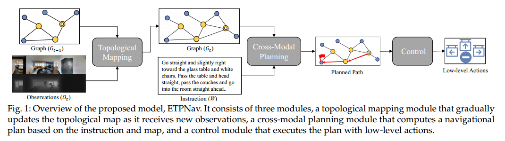
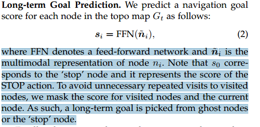

# ETPNav: Evolving Topological Planning for Vision-Language Navigation in Continuous Environments

ETPNav:连续环境中视觉语言导航的进化拓扑规划

## 何为ETPNav

1. the capability to abstract environments and generate long-range navigation plans
2.  the ability of obstacle-avoiding control in continuous environments.

ETPNav在没有环境先验的情况下，通过沿着一条走过的路径 自组织 预测路径点，完成对环境的在线拓扑映射。

将导航 分解为 高级规划 和 低级控制

ETPNav利用基于transformer的跨模态 规划器 根据拓扑图 和 指令 生成导航计划。之后，该 计划 由 避障控制器 执行。避障控制器利用试错启发式来防止导航卡在障碍物总。

## Introduction

连续 和 离散 VLN？  端到端？ 从语言和观察中 **直接** 预测低级动作和路径点？VLN-CE不如VLN-离散

modular waypoint-based approaches：在每个决策循环中，智能体使用预训练的网络来预测附近的几个候选路点，然后使用跨模态模型，从这些路点中选择子目标。之后，控制器通过低级动作驱动到达选定的子目标。总体而言，这种模块化管道简化了**策略学习**，缩小了VLN- ce和VLN之间的性能差距。

**作者的观点**：这些基于路径点的方法仍然存在三个方面的缺陷。

1. **预测的路径点仍然是局部的，并且被限制在智能体的附近区域，**这不足以捕获全局环境布局，并且可能阻碍智能体的长期规划能力。例如，为了纠正过去的决策，要回溯到以前的远程位置，智能体必须运行多个计划控制流，这可能会引入不稳定的积累偏差。
2. 对航路点预测的关键设计选择还没有很好的研究。一个代表性的**预测器**将RGBD图像作为输入，但语义级RGB输入是否有效仍然未知，因为它只负责推断**空间可达性**。
3. 避障控制未被研究。相反，这些方法要么采用直接的启发式方法[9]，要么采用现成的控制器[12]。因此，智能体很可能会卡在障碍物中，提前停止，导致导航失败。   **这个属于深度学习研究吗？是否是传统控制算法？**

**作者的方法**：分层导航框架：**拓扑映射，低级控制器**

> **拓扑映射**：不需要预定义图，不需要环境预探索？ 通过 被预测路径点的在线自组织 建立？？？  **何为online self-organization**
>
> **仅深度**的路径点预测有助于在新环境中进行**泛化**，而RGB信息可能会破坏空间可达性推断。
>
> **控制器**：通过试错启发式来显式地帮助代理摆脱死锁，几乎消除了滑动禁止造成的性能损失。     更有挑战性的场景——禁止沿着障碍物滑动（**什么意思？不能贴边走？**那用 基于势能的路径规划算法ego-planner？） **场景是静态的吗？**

**贡献：**

1. 提出了一种新的**基于拓扑地图的VLN-CE鲁棒导航规划方法**。它能有效地对连续环境进行抽象，便于智能体进行长期目标规划。
2. 我们通过全面的实验研究了**构建拓扑地图**的基本设计选择，证明了简洁的**深度**设计对于路点预测是最佳的。
3. 我们研究了VLN-CE中一个实际重要但很少被研究的问题——**避障**，并提出了一种有效的启发式控制器来解决这个问题
4. 该系统赢得了CVPR 2022 RxRHabitat挑战赛

## RELATED WORK

 the prediction of **language-conditioned waypoints** requires the model to learn **spatial accessibility inferring** and **cross-modal reasoning simultaneously**, which is difficult and may need massive training

最近，新兴趋势：modular waypoint-based approach。这些方法不是直接预测语言条件下的路点，而是**进一步将子目标预测解耦**为 **候选路点生成** 和 **子目标选择** 。 

地图构建很重要。我们的地图是通过**每一步预定义的路径点的自组织（self-organization）**在线构建的。该方法具有随导航进程可扩展的特点，并且满足真实环境中部分可观测性的假设。

## 3. METHOD

无法返回了？？？

