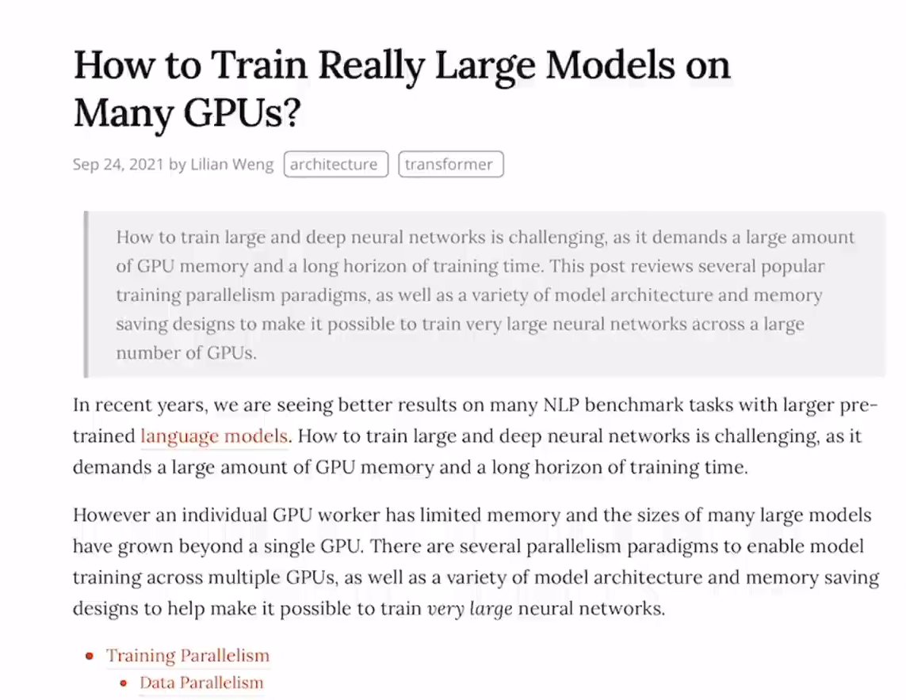

# CLIP

[toc]

# Learning Transferable Visual Models From Natural Language Supervision

自然语言作为监督信号，打破传统类别标签的限制。

# 从文本/图像特征 到 多模态特征的映射

 We do not use the non-linear projection between the representation and the contrastive embedding space, a change which was introduced by Bachman et al. (2019) and popularized by Chen et al. (2020b). We instead use only a linear projection to map from each encoder’s representation to the multi-modal embedding space. We did not notice a difference in training efficiency between
the two versions and speculate that non-linear projections may be co-adapted with details of current image only in self-supervised representation learning methods.

我们没有使用表征和对比嵌入空间之间的**非线性投影**，这种变化是由Bachman等人(2019)引入的，并由Chen等人(2020b)推广。

我们只使用**线性投影**将每个编码器的表示映射到多模态嵌入空间。

我们没有注意到两个版本之间的训练效率差异，并推测非线性投影可能仅在自监督表示学习方法中与当前图像的细节共同适应。

# 不需要fine-tuning

之前的自监督学习都需要在下游任务上微调，而CLIP可以直接应用到下游任务（zero-shot transfer），利用提示 学习

# prompt engineering and ensembling

重要！zero-shot infer

微调和推理时用的方法，而不是预训练阶段

为什么需要**提示模板**？1.一词多义问题，2.很少出现 一个词对应一张图片的情况。即为了尽量符合训练时的数据分布

在提示模板中，可以使用先验信息。

ensemble（集成）：综合使用多个提示模板

# 预训练

预训练的目的是为了得到，非常好，能泛化的特征

# 模型选择

ResNet、Transformer都是模型架构，具体参数还需要训练

# 关于工程实现的细节

如何多GPU训练？

