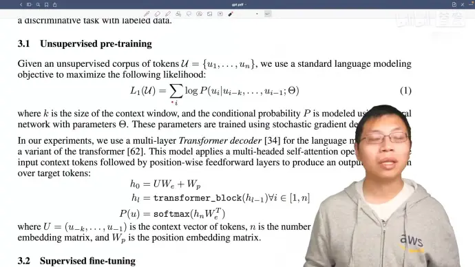
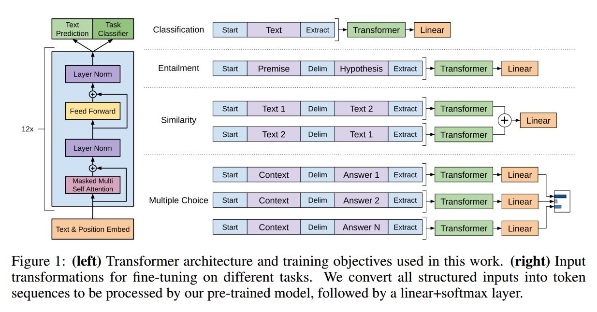
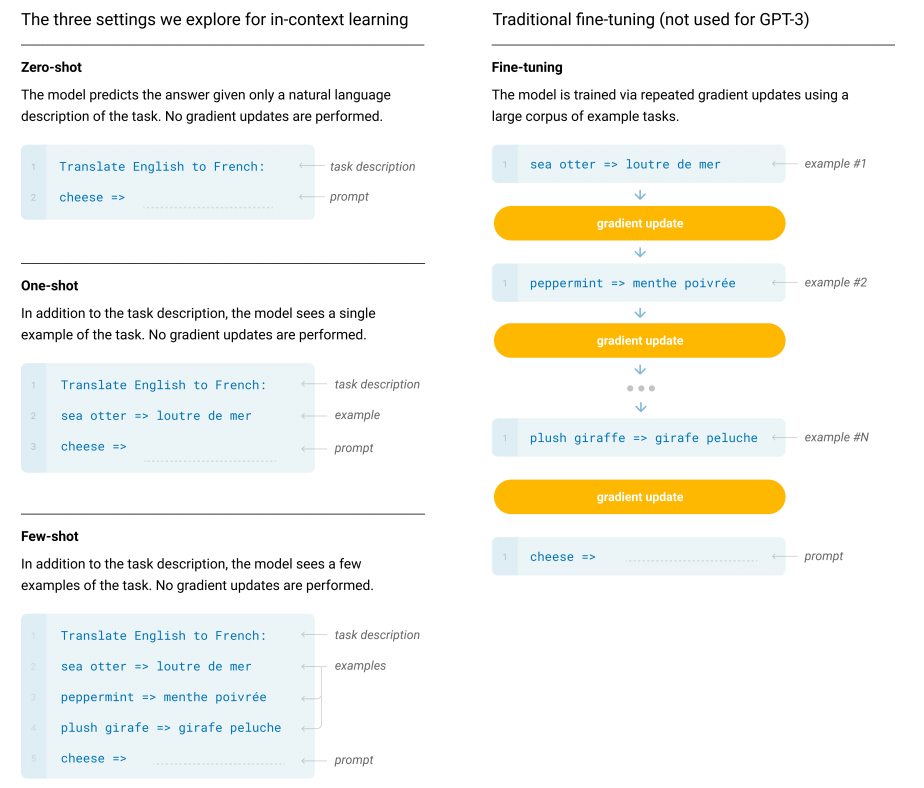

# GPT1和BERT区别

使用transformer的解码器，masked attention，预测未来，生成式模型

而bert是transformer的编码器，完形填空.

# GPT1

生成式（回归）预训练，

判别式（分类）微调，构造输入形式，和输出线性层，中间的transformer都是一样的

# GPT2

没有微调，换成zero-shot，直接上

zero-shot：使用prompt

# GPT3

使用few-shot 

但是在微调时，没有梯度更新，而是通过文本交互的方式

生成人类无法分辨的文章

**特殊的few-shot方式**

# 多任务学习

Mutitask Learning，训练一个模型时，同时看多个数据集。
