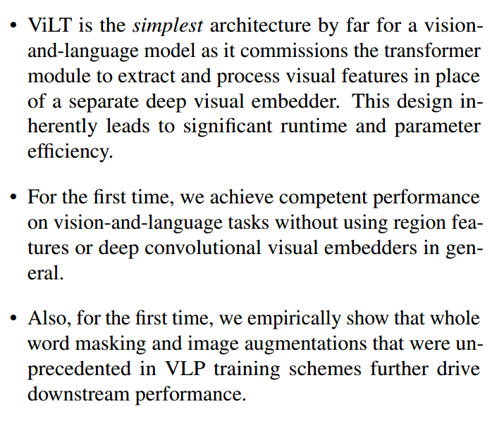

# **ViLT: Vision-and-Language Transformer**

# **Without Convolution or Region Supervision**

# 预训练目标函数

1. image text matching
2. masked language modeling 

# 之前的工作：

依赖图像的目标检测，问题：

1. 图像部分的计算比多模态模型部分大
2. 预训练的图像网络表达能力有限

为什么用目标检测：

1. 离散的图片表示，bounding box，明确的语义
2. 下游任务也和物体有关

改进：去掉目标检测，直接使用最后一层特征图，例如7x7特征图 -> 长度49的序列

# 改进

利用patch embedding 替代 复杂的图像特征抽取（目标检测、Region Feature）

每个patch就相当于是1个单词，相当于有一种对应关系

# 贡献

# Vision-and-Language Model分类

1. 两种模态的表达力度（参数量和计算量）
2. 两种模态是否在深层网络中交互

# 模态融合方法Modality Interaction Schema

1. single-stream:把文本和图像特征直接concat成一个序列
2. dual-stream：两个模态在输入时没有concat，而是在各自先进一步抽取特征信息，在之后某个时间点融合。需要引入更多参数

# 单模态Embedding Schema

文本：一般使用预训练好的BERT的tokenizer ，word and position embeddings

视觉特征：

1. Region Feature.

   先经过一个Backbone抽取特征，然后经过RPN网络生成proposal，经过非极大值抑制nms筛选边界框，最后经过ROI head得到图像序列。结果就是把一张图像变成了离散的boundbox，每个边界框内都含有明确的类别语义信息。

2. Grid Feature

   仅基于Backbone 的特征图

3. Patch Projection

   直接将图像打成patch，然后根据patch得到图像序列 

# Vision-and-Language Transformer (本文的方法)

假设文本端有L个长为H 的序列，L为一个句子中单词数量，H为序列长度。图像端图像被打成N个patch，每个patch也对应长为H的序列。其中还加入了Modal-type embedding模态信息（文本为0，图像为1），Token position embedding文本位置信息，Patch position embedding图像位置信息。因此，Transformer Encoder的输入为（N+L+2）×H的矩阵。*代表[CLS] token，（N+L+2）×H 中2代表两种模态的[CLS]。位置嵌入和类别嵌入式拼接的。 

3个损失函数，其中Word Patch Alignment 可以看做，图像和文本这两个概率分布是否对齐

# 训练时的技巧

1. Whole word masking
2. Image Augmentation