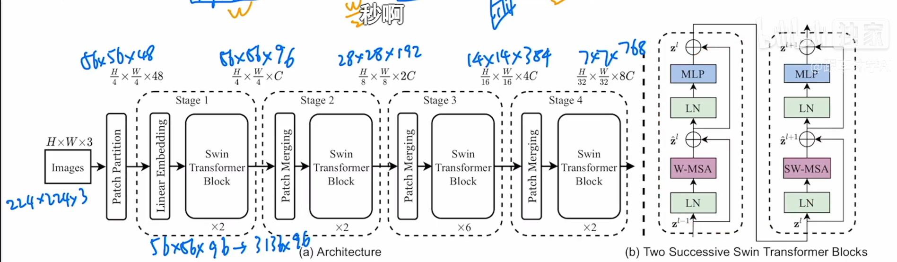
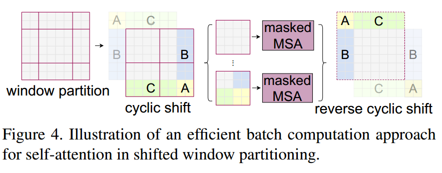
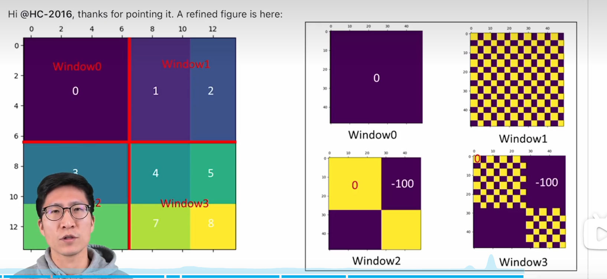

# Swin Transformer

transformer从nlp到cv的难点：序列长度如何选取！！

先每个窗口算自注意力 ，再 移动窗口算 自注意力

##1移动窗口自注意力机制

###1.1 移位重组

每个原来的窗口 都拿出一部分 去作跨窗口的transformer，以增大感受野

###1.2 掩码

**很灵性**，避免了 **空间上不临接的块之间** 作transformer

