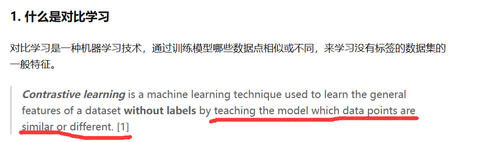
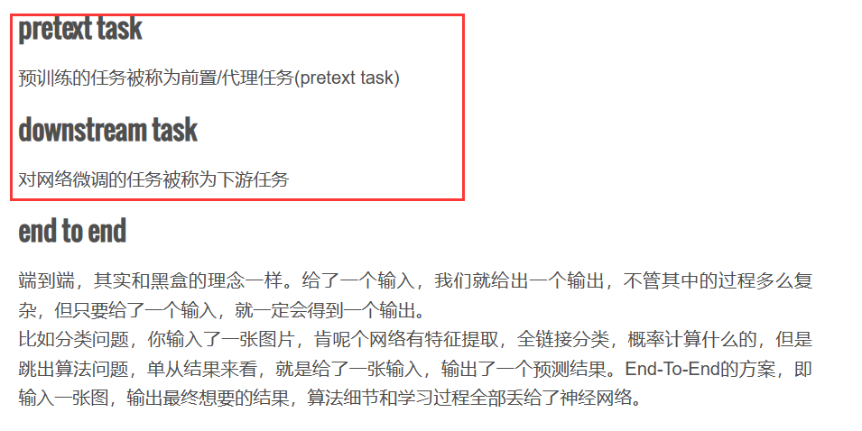
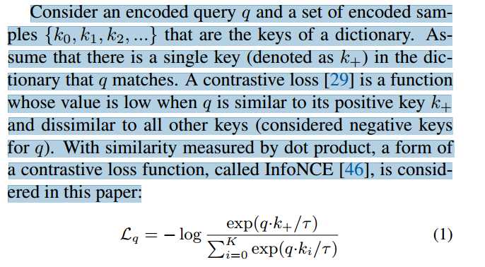
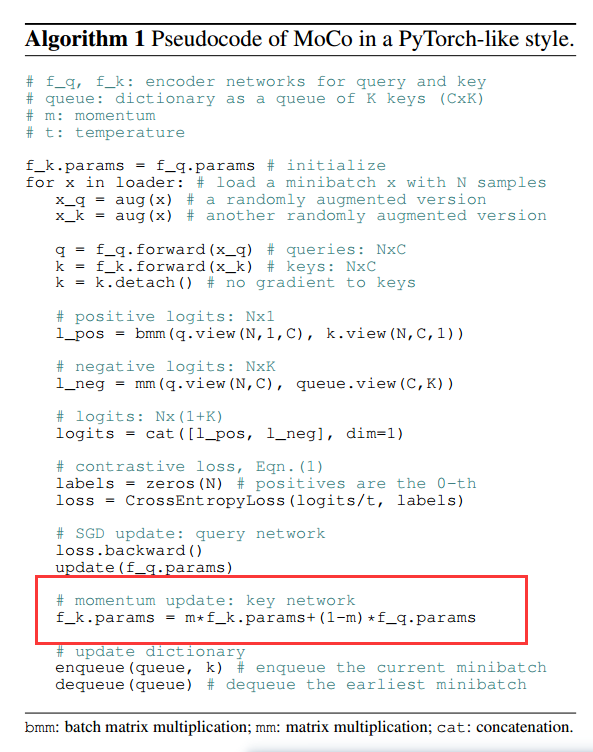

# 对比学习

代理任务定义的规则：数据集中，一个样本及其变种属于一个类（正样本），其余样本都不属于这个类（负样本）。又叫个体判别（instance discrimination）

**对比学习**的目标是学习一个编码器，此编码器**对同类数据进行相似的编码，并使不同类的数据的编码结果尽可能的不同**。

怎么教？通过代理任务（预训练任务）教

**目标**：**给定锚点，通过空间变换，使得锚点与正样本间距离尽可能小，与负样本距离尽可能大**

# 自监督学习

无监督/自监督学习方法一般包含两个方面：代理任务 损失函数

pretext task（代理任务）意味着要解决的任务不是真正感兴趣的，只是为了学习良好的特征表示。和预训练任务一个意思 ？

代理任务提供一个自监督的信号，充当ground truth的角色

损失函数 可以 独立于代理任务 研究

# MoCo

NCEloss ：noise controstive estimation 噪声对比估计

K：字典的大小，字典是一个队列，会动态更新

伪代码：

f_k更新缓慢，在一定程度上，保证了key的一致性，即是由同一个编码器生成的。之所以这么做，是因为字典的大小K 远远大于 minbatch，如果f_k更新过快，会导致字典中的key不一致

 

无监督学习的一个**主要目标**是学习可转移的特征。